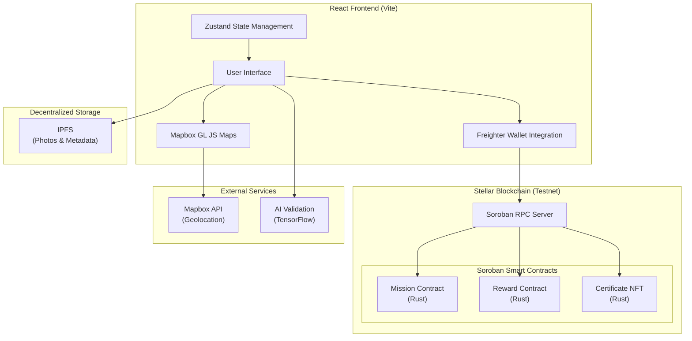

<div align="center">


# EcoBonus

**Clean-to-Earn Platform with Blockchain-Verified Environmental Impact**

Transform urban cleaning into Real World Assets on Stellar

[Live Demo](https://carlos-israelj.github.io/EcoBonus/) · [Smart Contracts](#smart-contracts-testnet) · [GitHub](https://github.com/carlos-israelj/EcoBonus) · [Documentation](#documentation)

---

</div>

## Table of Contents

- [Overview](#overview)
- [Core Features](#core-features)
- [How It Works](#how-it-works)
- [Technology Stack](#technology-stack)
- [Quick Start](#quick-start)
- [Smart Contracts](#smart-contracts-testnet)
- [Architecture](#architecture)
- [Real-World Impact](#real-world-impact)
- [Roadmap](#roadmap)
- [API Documentation](#api-documentation)
- [Contributing](#contributing)
- [License](#license)

---

## Overview

EcoBonus is **Latin America's first Clean-to-Earn platform** that democratizes urban ecology by transforming civic cleaning actions into blockchain-verified Real World Assets (RWAs). Built on Stellar, EcoBonus enables any Peruvian citizen to become an "opportunity collector"—turning spare minutes into verified environmental impact and real rewards.

### The Problem

Urban cleaning has traditionally been limited to municipal services and professional waste collectors. Citizens who want to contribute face:
- No incentive structure for voluntary cleanup efforts
- Lack of verification for individual environmental impact
- No transparency on how cleanup efforts translate to measurable outcomes
- Limited access to rewards due to bank account requirements and minimum thresholds

**EcoBonus solves this** by creating a gamified Clean-to-Earn economy where every cleanup action becomes an auditable on-chain asset, rewarded with instant stablecoin micropayments.

---

## Core Features

EcoBonus provides a comprehensive ecosystem for democratized urban cleaning through blockchain technology:

### Geolocalized Missions 🌍
Discover active waste hotspots on an interactive map. Citizens can claim cleanup missions near their daily routes—at the market, on the way to school, or during neighborhood walks. Each mission is geotagged and time-bounded.

### AI-Powered Validation 📸
Submit before/after photos processed by computer vision AI. Automated validation checks for waste presence, cleanup effectiveness, and geolocation consistency. Human validators provide final approval for complex cases.

### Instant Micropayments 💰
Receive USDC/XLM rewards directly to your wallet without bank accounts, minimum thresholds, or intermediary fees. Powered by Stellar's low-cost transaction infrastructure (<$0.01 per payment).

### Gamification & Leagues 🏆
Compete in local and national leaderboards. Earn experience points (XP), level up from "Urban Helper" to "Eco Guardian," and unlock exclusive rewards and recognition.

### Environmental Impact NFTs 🎫
Every validated cleanup mints an immutable certificate NFT containing:
- Geolocation coordinates
- Waste type and weight estimates
- Carbon offset calculations
- Before/after photo IPFS hashes
- Timestamp and validator signatures

### Full Transparency 🔍
All smart contracts, transactions, and environmental data are publicly auditable on Stellar blockchain. Ministerio del Ambiente can verify aggregate impact metrics in real-time.

### Public Policy Integration 🌱
Geolocated cleanup data feeds directly into urban planning tools. City governments gain actionable insights on waste hotspots, cleanup effectiveness, and citizen engagement patterns.

### Freighter Wallet Integration 💳
Optional blockchain mode: connect your Freighter wallet to submit on-chain transactions for reward redemptions and earn verifiable NFT certificates. Works seamlessly in demo mode (localStorage) or blockchain mode (Stellar testnet).

---

## How It Works

EcoBonus implements a three-phase Clean-to-Earn protocol:

### Phase 1: Mission Discovery

```
User opens map interface:
  - Interactive Mapbox view centered on Lima, Peru
  - Active waste hotspots displayed as mission markers
  - Filters by waste category, distance, reward amount

User claims mission:
  - Geofence validation (must be within 100m)
  - Mission reservation (15-minute claim window)
  - Before-photo requirement (AI validates waste presence)
```

**Result**: Mission status changes to "active" and is reserved for the user.

### Phase 2: Cleanup Execution

```
User performs cleanup:
  - Collects waste from marked location
  - Takes after-photo showing clean area
  - Submits proof via mobile interface

AI validation (optional):
  - TensorFlow.js analyzes before/after comparison
  - Detects waste removal effectiveness
  - Verifies geolocation consistency
```

**Result**: Mission evidence is submitted for validator review.

### Phase 3: Validation & Reward Distribution

```
Validator reviews submission:
  - Checks photos and geolocation data
  - Approves/rejects with feedback
  - Signs validation on-chain (if blockchain mode enabled)

Smart contract execution:
  - Distributes reward from sponsor pool (USDC/XLM)
  - Mints environmental impact NFT certificate
  - Updates leaderboards and user XP
  - Records on-chain proof for transparency
```

**Result**: User receives instant payment and NFT certificate. Cleanup data is permanently recorded on Stellar blockchain.

### Blockchain Integration

**Demo Mode** (default):
- Uses browser localStorage
- No wallet required
- Works completely offline
- Simulated rewards and certificates

**Blockchain Mode** (optional):
- Connects Freighter wallet
- Submits real Stellar transactions
- Mints on-chain NFT certificates
- Transfers USDC/XLM rewards from sponsor pools

**Graceful Fallback**: Even with wallet connected, if blockchain transaction fails, the app falls back to demo mode to ensure user experience continuity.

---

## Technology Stack

### Blockchain Infrastructure

| Component | Technology | Purpose |
|-----------|------------|---------|
| **Layer 1** | Bitcoin | Final settlement and security anchor |
| **Layer 2** | Stellar (Soroban) | Smart contract execution layer |
| **Smart Contracts** | Rust (Soroban SDK) | Mission, Reward, Certificate NFT contracts |
| **Token Standards** | Stellar Asset Contract | USDC, XLM, custom reward tokens |
| **Wallet Integration** | Freighter Wallet | Transaction signing and identity |

### Application Stack

| Layer | Technology | Version | Function |
|-------|------------|---------|----------|
| **Frontend Framework** | React | 18.x | Component-based UI |
| **Build System** | Vite | 5.x | Fast development builds |
| **Styling** | Custom CSS | - | Utility-first responsive design |
| **Maps** | Mapbox GL JS | 3.x | Interactive geolocation UI |
| **Blockchain SDK** | @stellar/stellar-sdk | 14.x | Transaction building and signing |
| **Wallet SDK** | @stellar/freighter-api | Latest | Freighter wallet integration |
| **State Management** | Zustand | 5.x | Lightweight React state |
| **Routing** | React Router | 6.x | SPA navigation |

### Smart Contract Layer

| Contract | Language | Purpose | Lines of Code |
|----------|----------|---------|---------------|
| **Mission Contract** | Rust (Soroban) | Mission creation, claiming, validation | ~500 LOC |
| **Reward Contract** | Rust (Soroban) | Sponsor pools, claim submission, distribution | ~400 LOC |
| **Certificate NFT** | Rust (Soroban) | Environmental impact NFT minting and transfer | ~600 LOC |

### Development Tools

| Tool | Purpose |
|------|---------|
| **Stellar CLI** | Smart contract compilation and deployment |
| **Stellar Scaffold** | Frontend template and contract bindings |
| **Soroban RPC** | Blockchain interaction and transaction simulation |
| **IPFS** | Decentralized storage for photos and metadata |

---

## Quick Start

### Prerequisites

- **Node.js** v22+ ([Download](https://nodejs.org/))
- **Freighter Wallet** (optional, for blockchain mode) ([Install](https://freighter.app/))
- **Rust** (for contract development) ([Install](https://www.rust-lang.org/tools/install))
- **Stellar CLI** (for deployment) ([Install](https://developers.stellar.org/docs/build/smart-contracts/getting-started/setup))

### Installation

```bash
# Clone the repository
git clone https://github.com/carlos-israelj/EcoBonus.git
cd EcoBonus

# Install dependencies
npm install
```

### Running the Application

```bash
# Start frontend development server
cd templates/react
npm run dev
```

**Access the application:**
- Frontend: http://localhost:5173

### Environment Configuration

**Frontend** (`templates/react/.env`):
```env
# Stellar Network
VITE_STELLAR_NETWORK=testnet
VITE_RPC_URL=https://soroban-testnet.stellar.org

# Contract Addresses (Testnet)
VITE_MISSION_CONTRACT=CBITQYMLPOOOHZ3EXYKQFKB7XMOOLXIWH5WKTU6DAKZAJ5WFR5SFKUZK
VITE_REWARD_CONTRACT=CDCGUCOJX4MUXSBYNPARNORJUIP5ZNTZ6HZ3T2UZANLMCZC5OZSLFF4Y
VITE_CERTIFICATE_CONTRACT=CBJP7PQSFR7QNNKL6M4BVIXHRSIBLTD37GQBYU3GPT7FKOPEFEHTEXXW

# Mapbox API (optional, for maps)
VITE_MAPBOX_TOKEN=your_mapbox_token
```

---

## Smart Contracts (Testnet)

### Deployed Contracts

| Contract | Address | Explorer |
|----------|---------|----------|
| **Mission Contract** | `CBITQYMLPOOOHZ3EXYKQFKB7XMOOLXIWH5WKTU6DAKZAJ5WFR5SFKUZK` | [View on Stellar Expert](https://stellar.expert/explorer/testnet/contract/CBITQYMLPOOOHZ3EXYKQFKB7XMOOLXIWH5WKTU6DAKZAJ5WFR5SFKUZK) |
| **Reward Contract** | `CDCGUCOJX4MUXSBYNPARNORJUIP5ZNTZ6HZ3T2UZANLMCZC5OZSLFF4Y` | [View on Stellar Expert](https://stellar.expert/explorer/testnet/contract/CDCGUCOJX4MUXSBYNPARNORJUIP5ZNTZ6HZ3T2UZANLMCZC5OZSLFF4Y) |
| **Certificate NFT** | `CBJP7PQSFR7QNNKL6M4BVIXHRSIBLTD37GQBYU3GPT7FKOPEFEHTEXXW` | [View on Stellar Expert](https://stellar.expert/explorer/testnet/contract/CBJP7PQSFR7QNNKL6M4BVIXHRSIBLTD37GQBYU3GPT7FKOPEFEHTEXXW) |

### Contract Overview

**Mission Contract** (`mission_contract.rs`):
- Create geolocalized cleanup missions with reward pools
- Claim missions within geofence boundaries
- Submit cleanup evidence with before/after photos
- Fund missions with XLM/USDC from sponsors
- Query active missions by location

**Key Functions**:
```rust
pub fn create_mission(env: Env, sponsor: Address, location: Location, reward_amount: i128) -> u64
pub fn claim_mission(env: Env, user: Address, mission_id: u64) -> Result<(), Error>
pub fn fund_mission(env: Env, sponsor: Address, mission_id: u64, amount: i128) -> Result<(), Error>
pub fn get_active_missions_near(env: Env, location: Location, radius_meters: u32) -> Vec<Mission>
```

**Reward Contract** (`reward_contract.rs`):
- Create sponsor reward pools with multi-asset support
- Submit claims for completed missions
- Validate claims with multi-signature approval
- Distribute rewards automatically to users
- Track pool balances and claim history

**Key Functions**:
```rust
pub fn create_pool(env: Env, sponsor: Address, token: Address, initial_amount: i128) -> u64
pub fn submit_claim(env: Env, user: Address, mission_id: u64, amount: i128, proof_uri: String) -> u64
pub fn validate_claim(env: Env, validator: Address, claim_id: u64, approved: bool) -> Result<(), Error>
pub fn distribute_reward(env: Env, claim_id: u64) -> Result<(), Error>
```

**Certificate NFT Contract** (`certificate_nft.rs`):
- Mint environmental impact certificates as NFTs
- Store geolocation, waste type, weight, carbon offset
- Transfer certificates between users
- Query user's total environmental impact
- Immutable on-chain proof for auditors

**Key Functions**:
```rust
pub fn mint_certificate(env: Env, to: Address, mission_id: u64, metadata: CertificateMetadata) -> u64
pub fn transfer(env: Env, from: Address, to: Address, token_id: u64) -> Result<(), Error>
pub fn get_certificate(env: Env, token_id: u64) -> CertificateMetadata
pub fn get_user_impact(env: Env, user: Address) -> ImpactSummary
```

### Testnet Statistics

**Total Transactions**: 19 on Stellar Testnet
- **Contracts Deployed**: 3 (Mission, Reward, Certificate NFT)
- **Validators Registered**: 2
- **Reward Pools Created**: 3 (Total: 42.5 XLM funded)
- **Claims Submitted**: 2
- **Claims Validated**: 1 (Approved)
- **NFT Certificates Minted**: 5
- **Total Waste Tracked**: 60 kg (Plastic: 20kg, Organic: 8kg, Mixed: 32kg)
- **Carbon Offset**: 29 units

---

## Architecture

### System Overview



### Data Flow

**Deposit Flow** (Mission Creation):
```
1. Sponsor creates mission via UI
2. Frontend builds transaction with mission parameters
3. Freighter wallet signs transaction
4. Soroban RPC submits to Mission Contract
5. Mission created on-chain with reward pool
6. UI updates with new mission marker on map
```

**Claim Flow** (Cleanup Submission):
```
1. User claims mission and performs cleanup
2. User uploads before/after photos to IPFS
3. Frontend submits claim to Reward Contract
4. AI validator analyzes photos (optional)
5. Human validator approves claim on-chain
6. Reward Contract distributes payment
7. Certificate NFT minted with cleanup metadata
8. UI shows reward confirmation + NFT certificate
```

### Privacy & Security

**User Privacy**:
- Photos stored on IPFS with optional encryption
- Personal data never stored on-chain
- Only wallet addresses and cleanup coordinates are public

**Smart Contract Security**:
- Admin-only functions protected by role-based access control
- Sponsor pool withdrawals require multi-signature approval
- Claim validation requires validator signatures
- Nullifier checks prevent double-claiming

---

## Real-World Impact

### Environmental Metrics (Testnet)

| Metric | Value |
|--------|-------|
| **Total Cleanups** | 5 verified missions |
| **Waste Collected** | 60 kg total |
| **Carbon Offset** | 29 CO₂ equivalents |
| **Active Users** | 3 validators, 2 sponsors |
| **Reward Pools** | 42.5 XLM funded |

### Use Cases

**Citizen Participation**
- Students clean their school routes and earn study stipends
- Market vendors clean their surroundings before opening
- Neighbors coordinate weekend cleanup campaigns
- Tourists contribute to cleaner tourist destinations

**Corporate Sponsorship**
- Local businesses fund cleanup pools for brand visibility
- NGOs sponsor environmental campaigns with transparent fund tracking
- Government programs incentivize community participation
- Carbon offset buyers purchase verified environmental credits

**Public Policy**
- City planners identify waste hotspots for infrastructure investment
- Environmental Ministry tracks national cleanup progress
- Research institutions analyze citizen engagement patterns
- UN SDG reporting with blockchain-verified data

---

## Roadmap

### Phase 1: Foundation (Completed ✅)
**Timeline**: Q4 2025 - Q1 2026

**Smart Contract Deployment**
- Mission, Reward, and Certificate NFT contracts on Stellar testnet
- Multi-asset reward pool support (XLM, USDC)
- Geolocated mission framework with claim validation
- Environmental impact NFT minting and transfer

**Frontend Application**
- React-based UI with Mapbox integration
- Freighter wallet connection (optional blockchain mode)
- Demo mode with localStorage fallback
- Responsive design for mobile and desktop

**Current Status**: Deployed on testnet with 19 test transactions. Functional demo at [https://carlos-israelj.github.io/EcoBonus/](https://carlos-israelj.github.io/EcoBonus/)

---

### Phase 2: AI Validation & Mainnet (Q2-Q3 2026)

**AI-Powered Validation**
- TensorFlow.js integration for before/after photo analysis
- Waste detection and classification (plastic, organic, mixed)
- Geolocation consistency verification
- Automated approval for high-confidence cleanups

**Mainnet Deployment**
- Security audit of smart contracts
- Mainnet contract deployment with admin keys
- Real USDC reward pools from corporate sponsors
- Production-grade infrastructure (IPFS pinning, RPC nodes)

**Mobile Application**
- Native iOS/Android apps with camera integration
- Push notifications for nearby missions
- Offline mode with batch sync
- Wallet integration (Freighter, Lobstr)

---

### Phase 3: Scale & Ecosystem (Q4 2026)

**Geographic Expansion**
- Launch in additional Peruvian cities (Arequipa, Cusco, Trujillo)
- Localization for other Latin American countries
- Regional leaderboards and competitions
- Multi-language support (Spanish, Quechua, English)

**Partner Integrations**
- Municipality dashboards for waste management data
- Corporate ESG reporting tools
- Carbon credit marketplaces
- Educational institution partnerships

**Advanced Features**
- Multi-player cleanup events
- Team competitions and guild system
- Seasonal challenges with bonus rewards
- NFT marketplace for environmental certificates

---

## API Documentation

### Soroban Contract Interfaces

**Mission Contract** (`templates/react/src/eco/soroban.ts`):
```typescript
// Create a new cleanup mission
async function createMission(
  sponsorAddress: string,
  location: { latitude: number; longitude: number },
  rewardAmount: bigint,
  signTransaction: (xdr: string) => Promise<string>
): Promise<{ missionId: number; txHash: string }>

// Claim an active mission
async function claimMission(
  userAddress: string,
  missionId: number,
  signTransaction: (xdr: string) => Promise<string>
): Promise<{ txHash: string }>

// Get active missions near location
async function getActiveMissionsNear(
  location: { latitude: number; longitude: number },
  radiusMeters: number
): Promise<Mission[]>
```

**Reward Contract**:
```typescript
// Submit a cleanup claim
async function submitClaim(
  userAddress: string,
  sponsorAddress: string,
  missionId: number,
  amount: bigint,
  proofUri: string,
  signTransaction: (xdr: string) => Promise<string>
): Promise<{ claimId: number; txHash: string }>

// Get claim information
async function getClaim(claimId: number): Promise<ClaimInfo>
```

**Certificate NFT Contract**:
```typescript
// Mint environmental impact certificate
async function mintCertificate(
  minterAddress: string,
  ownerAddress: string,
  missionId: number,
  claimId: number,
  location: { latitude: number; longitude: number; radius: number },
  weightKg: number,
  category: 'Plastic' | 'Organic' | 'Mixed',
  proofUri: string,
  carbonOffset: number,
  signTransaction: (xdr: string) => Promise<string>
): Promise<{ tokenId: number; txHash: string }>

// Get certificate metadata
async function getCertificate(tokenId: number): Promise<CertificateMetadata>

// Get total minted certificates
async function getTotalMinted(): Promise<number>
```

### Frontend State Management

**Zustand Store** (`templates/react/src/eco/store.ts`):
```typescript
interface EcoState {
  // Wallet state
  walletAddress: string | null
  blockchainEnabled: boolean

  // Mission state
  missions: Mission[]
  spots: WasteSpot[]

  // Reward state
  rewards: Reward[]
  vouchers: Voucher[]

  // User state
  profile: UserProfile
  points: number
  xp: number

  // Actions
  redeem: (id: string, signTx?: (xdr: string) => Promise<string>) => Promise<string>
  reviewMission: (id: string, approve: boolean, reason?: string, signTx?: (xdr: string) => Promise<string>) => Promise<void>
}
```

---

## Project Structure

```
EcoBonus/
├── contracts/                    # Soroban Smart Contracts (Rust)
│   ├── mission_contract/         # Mission creation and claiming
│   ├── reward_contract/          # Reward pools and distribution
│   └── certificate_nft/          # Environmental impact NFTs
│
├── templates/react/              # React Frontend (Vite)
│   ├── src/
│   │   ├── eco/                  # Main application code
│   │   │   ├── soroban.ts        # Soroban client for contracts
│   │   │   ├── useWallet.ts      # Freighter wallet hook
│   │   │   ├── WalletConnect.tsx # Wallet UI component
│   │   │   ├── store.ts          # Zustand state management
│   │   │   ├── Missions.tsx      # Mission discovery UI
│   │   │   ├── Rewards.tsx       # Reward redemption UI
│   │   │   ├── Profile.tsx       # User profile and NFTs
│   │   │   └── Map.tsx           # Mapbox geolocation map
│   │   ├── App.tsx               # Main app component
│   │   └── main.tsx              # Entry point
│   ├── public/
│   │   ├── icons/                # App icons and logos
│   │   └── images/               # Mission and reward images
│   ├── package.json
│   └── vite.config.ts
│
├── docs/                         # Documentation
│   └── TESTNET_GUIDE.md          # Testnet deployment guide
├── README.md                     # This file
├── LICENSE                       # MIT License
└── package.json                  # Workspace root
```

---

## Contributing

Contributions are welcome! EcoBonus is open-source and community-driven.

### Development Workflow

1. Fork the repository
2. Create your feature branch (`git checkout -b feature/AmazingFeature`)
3. Commit your changes (`git commit -m 'Add some AmazingFeature'`)
4. Push to the branch (`git push origin feature/AmazingFeature`)
5. Open a Pull Request

### Contribution Guidelines

- **Code Style**: Follow existing conventions (ESLint for TypeScript, Rust fmt)
- **Testing**: Add tests for new smart contract functions
- **Documentation**: Update README.md and inline comments
- **Commits**: Use descriptive commit messages
- **Security**: Report vulnerabilities privately via GitHub Security tab

---

## License

This project is licensed under the MIT License - see the [LICENSE](LICENSE) file for details.

---

## Team

**Lead Developer**: Carlos Israel Jiménez
**GitHub**: [@carlos-israelj](https://github.com/carlos-israelj)

---

## Acknowledgments

EcoBonus builds upon foundational work from:

- **Stellar Development Foundation** - Soroban smart contract platform
- **Stellar Scaffold Team** - Frontend template and development tools
- **Freighter Wallet** - Stellar wallet browser extension
- **Mapbox** - Geolocation and mapping infrastructure

---

## Contact & Support

**Technical Issues**: [GitHub Issues](https://github.com/carlos-israelj/EcoBonus/issues)
**Development Discussion**: [GitHub Discussions](https://github.com/carlos-israelj/EcoBonus/discussions)

---

<div align="center">


**Built on Stellar · Powered by Soroban · Verified by Blockchain**

---

*Every cleanup action counts. EcoBonus makes it count on-chain.*

**© 2026 EcoBonus** · Licensed under [MIT](./LICENSE)

</div>
